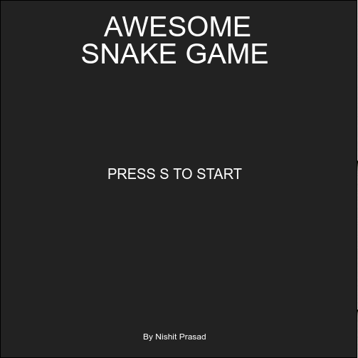
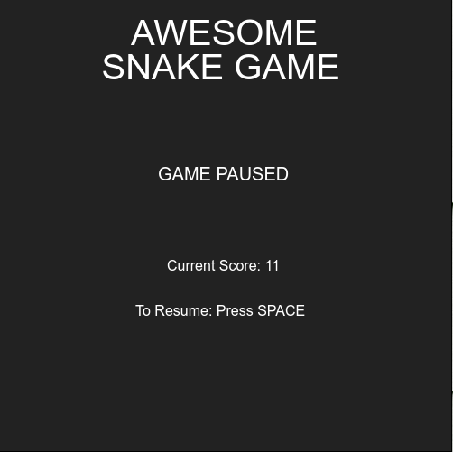
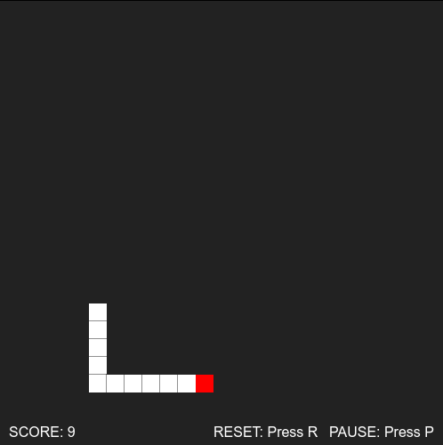
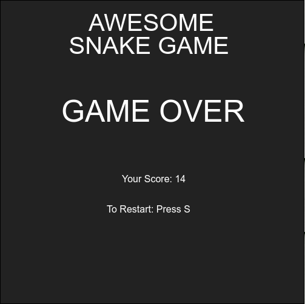

# Awesome Snake Game
---
AwesomeSnakeGame is a web application game that plays the classic snakes game.

It's a JS powered application that triggers the following events:
- `keydown`
-- Triggers when the user presses a key. It repeats while the user keeps the key pressed.
- `keyup`
-- Triggers when the user releases a key, after the default action of that key has been performed.

`HTML5, CSS3, JavaScript, VanillaJS`
